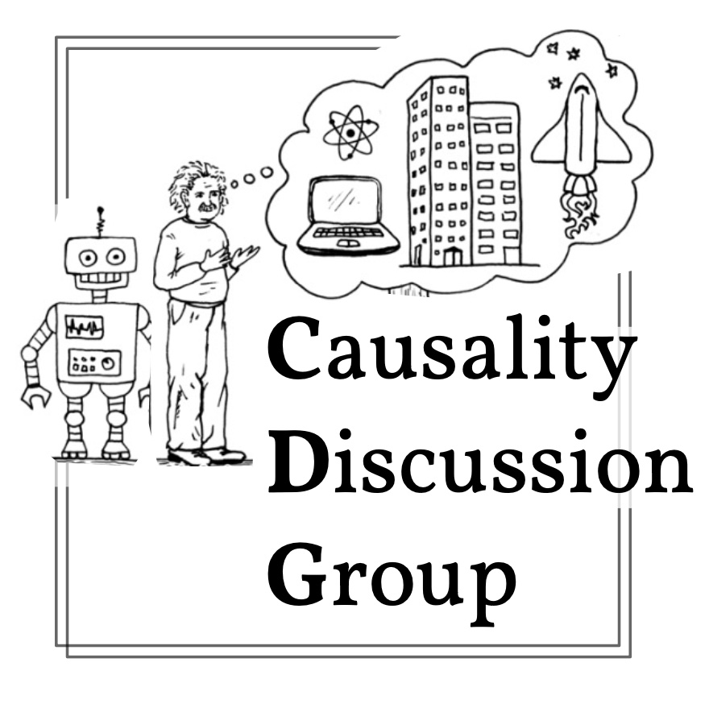

#### Causality Discussion Group

---

##### [discuss.causality.link](discuss.causality.link)

The official repository of the Causality Discussion Group. As of now, the scraper for the paper list is the only code element of the group.

Before running yourself, make sure that the desired parameters are set.

For OpenReview scraping, an account with credentials plus `openreview-py` are necessary.